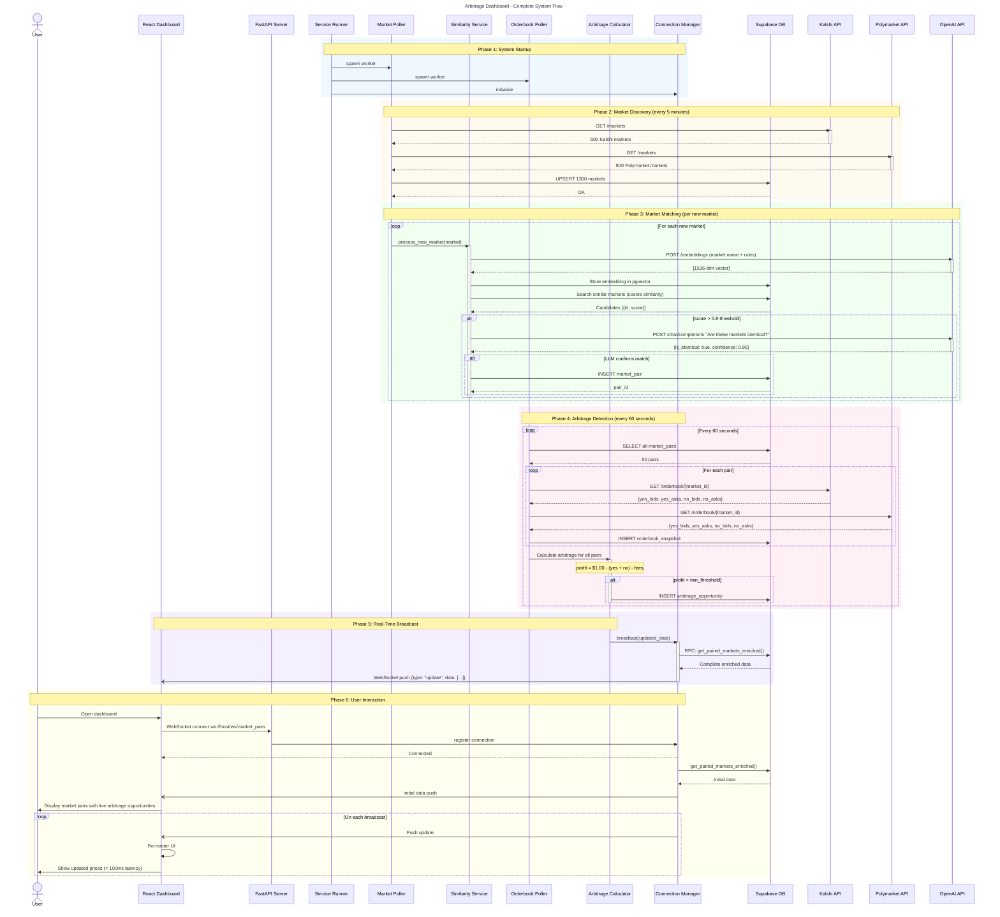
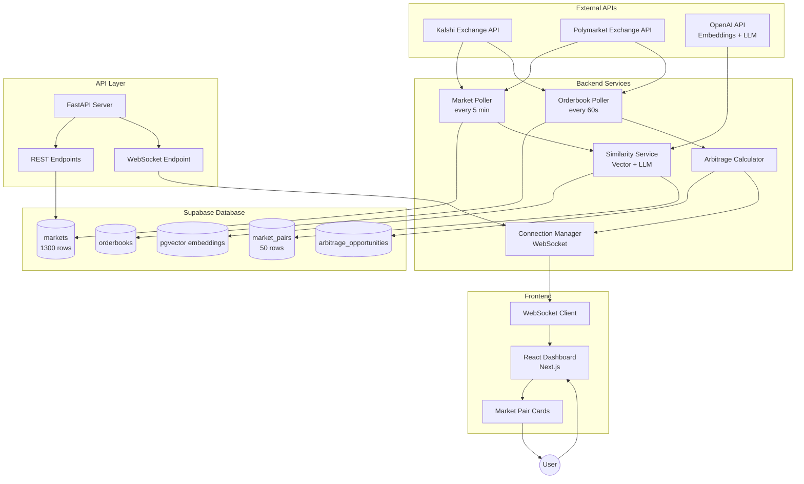
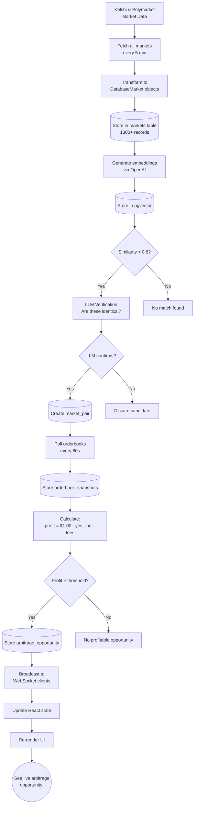

# System Sequence Diagram (Mermaid)

## Complete Application Flow



## System Architecture Overview



## Data Flow Diagram



## Component Interactions Summary

| Phase | Components | Action | Frequency |
|-------|------------|--------|-----------|
| 1. Startup | ServiceRunner | Spawns all background workers | Once |
| 2. Market Discovery | MarketPoller → Exchanges → DB | Fetch & store markets | Every 5 min |
| 3. Market Matching | SimilarityService → OpenAI → DB | Embed, search, verify, pair | Per new market |
| 4. Arbitrage Detection | OrderbookPoller → Calculator → DB | Poll prices, calculate profit | Every 60s |
| 5. Broadcast | ConnectionManager → WebSocket | Push updates to all clients | After each calculation |
| 6. User Display | React Dashboard | Render live data | On each WS message |

## How to Render These Diagrams

1. **GitHub/GitLab**: Mermaid is natively supported - just view the markdown file

2. **VS Code**: Install "Markdown Preview Mermaid Support" extension

3. **Online Editor**: Use [mermaid.live](https://mermaid.live) to edit and export

4. **Export to PNG/SVG**: Use mermaid CLI:
   ```bash
   npm install -g @mermaid-js/mermaid-cli
   mmdc -i SEQUENCE_DIAGRAM_MERMAID.md -o diagram.png
   ```
